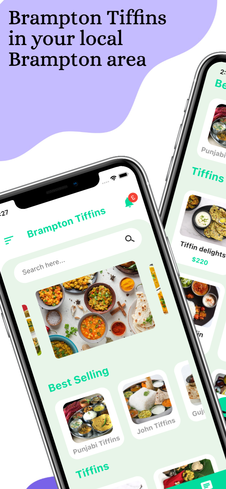
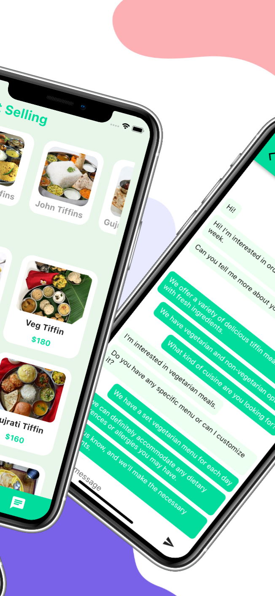
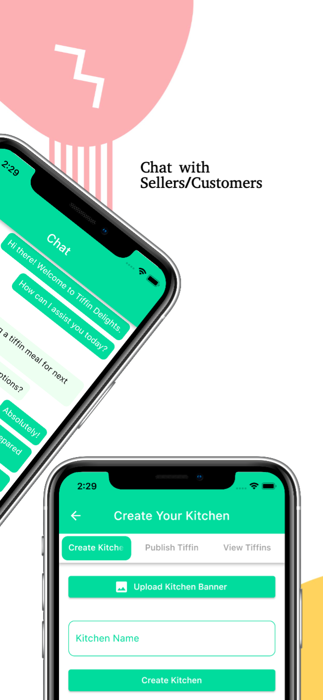
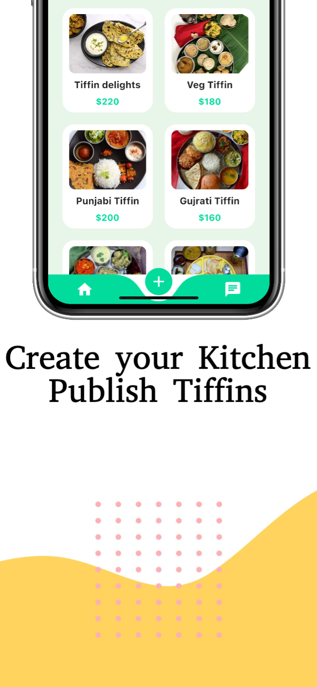
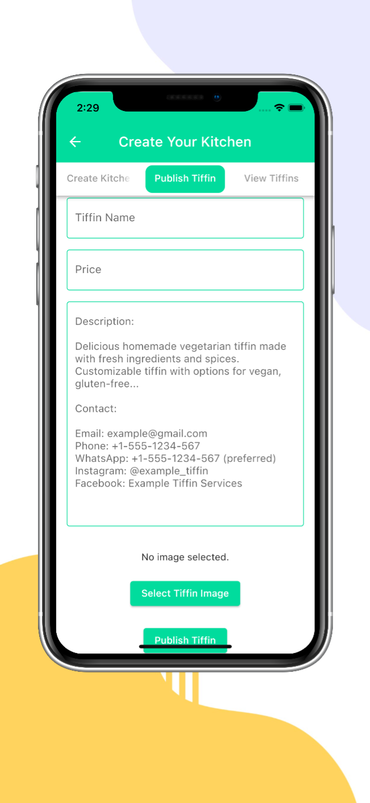

# Brampton Tiffins 
### (Flutter Android and iOS app with Laravel backend)

Brampton Tiffin is the go-to app for residents of Brampton, Canada, seeking delicious and convenient meals. Browse a wide variety of tiffins posted by local sellers and connect directly with them to satisfy your hunger cravings.

Our user-friendly interface allows you to effortlessly navigate through the app, making it convenient to discover tiffins that match your preferences. Once you've found the perfect meal, connect directly with the sellers through our secure messaging system. Discuss your dietary requirements, portion sizes, and any special requests to ensure a personalized and satisfying dining experience.

For sellers, Brampton Tiffin offers a platform to showcase your culinary skills and reach a wider audience. Create your kitchen profile, share enticing images of your mouthwatering tiffins, and let the app handle the marketing and customer engagement. Expand your customer base and establish your reputation as a talented chef in the local food scene.

